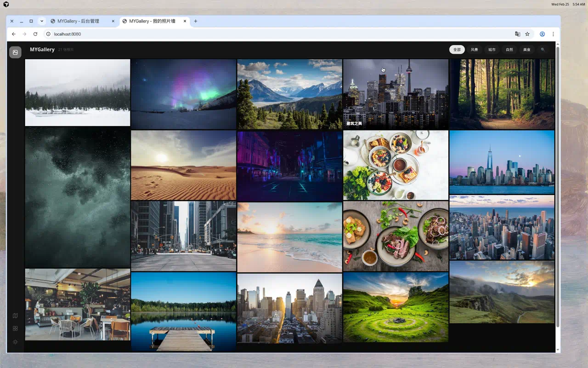
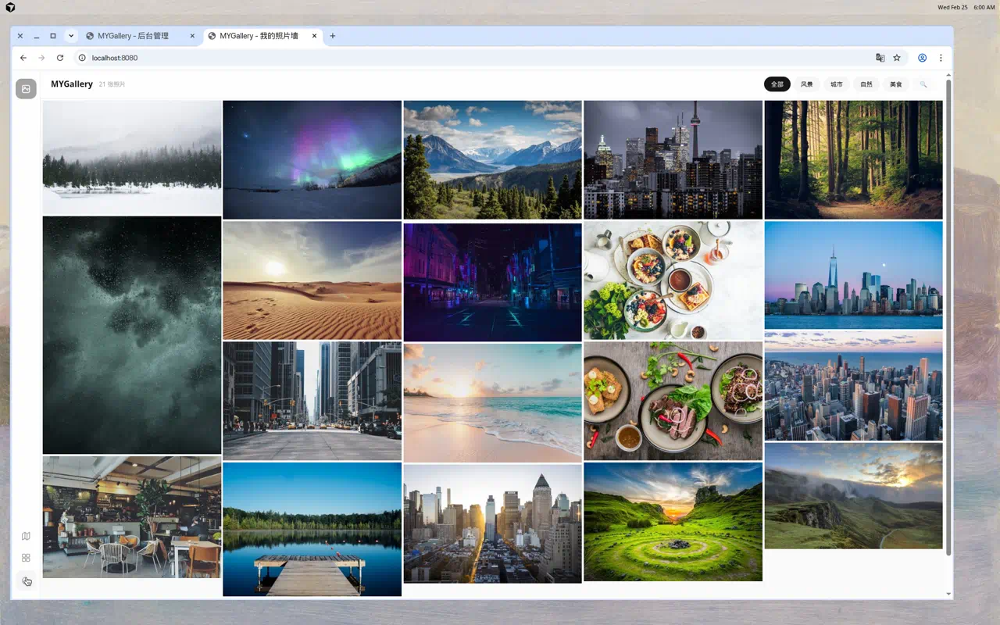
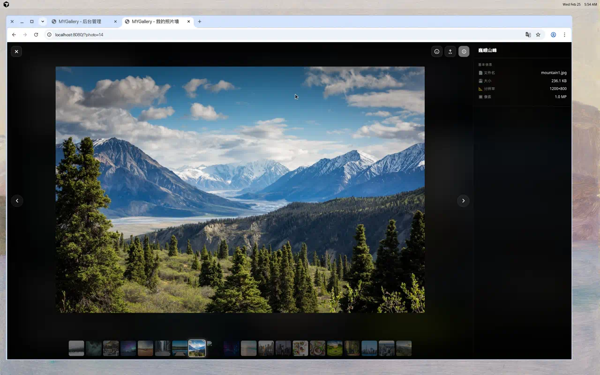
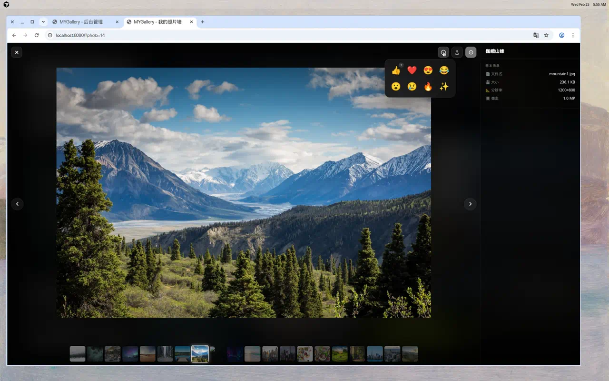
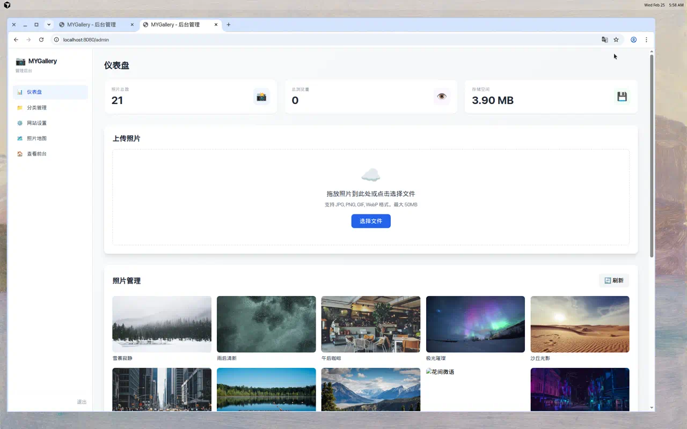

# MYGallery - 个人照片墙系统

<div align="center">
  <h1>📷 MYGallery</h1>
  <p>一个简约、美观、功能完整的个人照片墙系统</p>
  <p>
    
    
    
  </p>
</div>

---

## 📸 界面预览

### 暗色模式 · 瀑布流画廊
> 默认暗色主题，5列紧凑瀑布流，侧栏简笔画图标导航



### 亮色模式
> 一键切换白天/黑夜主题



### 灯箱查看器 · 信息面板
> ChronoFrame 风格全屏查看器，右侧信息面板展示 EXIF 元数据、分类标签，底部缩略图条可快速跳转



### 表态系统
> 访客可对照片进行 emoji 表态（👍❤️😍😂😮😢🔥✨），无需登录，基于指纹识别



### 照片地图
> 基于 Leaflet 的全屏地图，展示带 GPS 坐标的照片位置，支持聚合标记


### 后台管理
> ChronoFrame 风格侧栏导航，仪表盘统计，拖拽上传，照片管理



---

## ✨ 特性

### 🎨 精美的前端展示
- **瀑布流布局** — 5/4/3/2列自适应，4px 紧凑间距
- **暗色模式默认** — ChronoFrame 风格中性配色
- **侧栏图标导航** — SVG 简笔画图标，极简设计
- **灯箱查看器** — 全屏查看 + 右侧信息面板 + 底部缩略图导航
- **表态系统** — 8 种 emoji 表态，指纹识别匿名用户
- **分享链接** — 一键复制照片直链（`?photo=ID`），支持 Deep Link
- **分类筛选** — 按分类快速筛选，横向滑动支持
- **搜索功能** — 搜索标题、描述、标签、位置
- **黑夜模式** — 一键切换，记忆用户偏好

### 📱 移动端友好
- **响应式导航** — 移动端底部栏布局
- **触摸友好** — 卡片触摸交互，灯箱触摸滑动
- **底部信息弹窗** — 移动端信息面板自适应为底部弹出
- **横向分类滚动** — 分类过多时自动横向滚动

### ⚙️ 强大的后台管理
- **侧栏导航** — 仪表盘、分类管理、网站设置、地图、前台
- **拖拽上传** — 批量上传，实时进度
- **EXIF 自动提取** — 相机/手机照片元数据兼容
- **Live Photo 上传** — 同时上传照片和配套视频
- **分类管理** — 创建、编辑、删除分类

### 📍 照片地图
- **Leaflet 地图** — OpenStreetMap 瓦片，无需 API Key
- **照片标记** — 缩略图标记 + 弹出详情卡
- **聚合标记** — 密集区域自动聚合
- **缩放控制** — 放大/缩小/重置

### 🔧 灵活配置
- **多数据库** — SQLite（默认）、MySQL、PostgreSQL
- **多存储** — 本地、AWS S3、MinIO、阿里云 OSS
- **云端缩略图** — 所有存储后端支持缩略图自动上传

### 📸 EXIF 元数据
- 兼容相机（Sony/Canon/Nikon）和手机（iPhone/Android）
- 提取字段：品牌、型号、镜头、焦距、光圈、快门、ISO、GPS、白平衡、闪光灯、曝光模式、测光模式等
- EXIF 方向自动旋转缩略图

### 🎬 Live Photo
- 上传配套 `.mov` 视频
- 前端 LIVE 徽章标识

---

## 📦 快速开始

### 环境要求

- **Go 1.24+**（需 CGO，SQLite 驱动依赖）
- **GCC**（C 编译器）

### 本地运行

```bash
git clone https://github.com/danzai233/mygallery.git
cd mygallery
go mod download
cp config.example.yaml config.yaml
make init
go run main.go
```

访问：
- 📷 **前台**：http://localhost:8080
- ⚙️ **后台**：http://localhost:8080/admin
- 🗺️ **地图**：http://localhost:8080/map.html
- 👤 **默认账号**：`admin` / `admin123`

### Docker 部署

```bash
cp config.example.yaml config.yaml
docker compose build && docker compose up -d
```

### Makefile

```bash
make help    # 所有可用命令
make run     # 运行
make build   # 编译
make test    # 测试
make dev     # 热重载开发模式
```

---

## 🔧 配置详解

### 数据库

```yaml
database:
  type: "sqlite"  # sqlite / mysql / postgres
  sqlite:
    path: "./data/mygallery.db"
```

### 存储

```yaml
storage:
  type: "local"  # local / s3 / minio / aliyun
  local:
    upload_dir: "./uploads"
    thumbnail_dir: "./uploads/thumbnails"
    url_prefix: "/uploads"
```

<details>
<summary>S3 / MinIO / 阿里云 OSS 配置</summary>

```yaml
# AWS S3
storage:
  type: "s3"
  s3:
    region: "us-east-1"
    bucket: "mygallery"
    access_key: "YOUR_KEY"
    secret_key: "YOUR_SECRET"
    url_prefix: "https://bucket.s3.amazonaws.com"

# MinIO
storage:
  type: "minio"
  minio:
    endpoint: "localhost:9000"
    bucket: "mygallery"
    access_key: "minioadmin"
    secret_key: "minioadmin"
    use_ssl: false
    url_prefix: "http://localhost:9000/mygallery"

# 阿里云 OSS
storage:
  type: "aliyun"
  aliyun:
    endpoint: "oss-cn-hangzhou.aliyuncs.com"
    bucket: "mygallery"
    access_key: "YOUR_KEY"
    secret_key: "YOUR_SECRET"
    url_prefix: "https://mygallery.oss-cn-hangzhou.aliyuncs.com"
```

</details>

---

## 🌐 API 接口

### 公开接口

| 方法 | 路径 | 说明 |
|------|------|------|
| GET | `/api/photos` | 照片列表（`page`, `size`, `category`, `search`） |
| GET | `/api/photos/:id` | 照片详情 |
| GET | `/api/categories` | 分类列表 |
| GET | `/api/settings` | 网站设置 |
| GET | `/api/photos/:id/reactions` | 获取表态统计 |
| POST | `/api/photos/:id/reactions` | 添加/更新表态 |
| DELETE | `/api/photos/:id/reactions` | 删除表态 |
| GET | `/health` | 健康检查 |

### 需认证接口

| 方法 | 路径 | 说明 |
|------|------|------|
| POST | `/api/auth/login` | 登录 |
| POST | `/api/photos` | 上传照片（支持 Live Photo） |
| PUT | `/api/photos/:id` | 更新照片信息 |
| DELETE | `/api/photos/:id` | 删除照片 |
| POST | `/api/categories` | 创建分类 |
| PUT | `/api/categories/:id` | 更新分类 |
| DELETE | `/api/categories/:id` | 删除分类 |

---

## 🚀 部署方式

<details>
<summary>二进制直接运行</summary>

```bash
go build -o mygallery main.go
cp config.example.yaml config.yaml
mkdir -p data uploads uploads/thumbnails
./mygallery
```
</details>

<details>
<summary>Nginx 反向代理</summary>

```nginx
server {
    listen 80;
    server_name gallery.example.com;
    client_max_body_size 50M;
    location / {
        proxy_pass http://127.0.0.1:8080;
        proxy_set_header Host $host;
        proxy_set_header X-Real-IP $remote_addr;
        proxy_set_header X-Forwarded-For $proxy_add_x_forwarded_for;
    }
}
```
</details>

<details>
<summary>Systemd 服务</summary>

```ini
[Unit]
Description=MYGallery
After=network.target

[Service]
Type=simple
User=www-data
WorkingDirectory=/opt/mygallery
ExecStart=/opt/mygallery/mygallery
Restart=on-failure

[Install]
WantedBy=multi-user.target
```
</details>

---

## 🔒 安全建议

1. 修改默认密码
2. 修改 `config.yaml` 中的 JWT 密钥
3. 生产环境启用 HTTPS
4. 配置防火墙
5. 定期备份 `data/` 和 `uploads/`

---

## 🛠️ 技术栈

| 组件 | 技术 |
|------|------|
| 后端 | Go + Gin + GORM |
| 认证 | JWT |
| EXIF | rwcarlsen/goexif |
| 图片处理 | disintegration/imaging |
| 数据库 | SQLite / MySQL / PostgreSQL |
| 存储 | Local / S3 / MinIO / 阿里云 OSS |
| 前端 | Vanilla JS + Tailwind CSS |
| 地图 | Leaflet + OpenStreetMap |

## 📄 许可证

MIT License

---

<div align="center">
  <p>Made with ❤️ by MYGallery</p>
</div>
